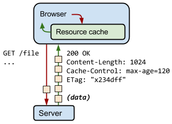

## Image cache

## Preload cache

## Service worker

## HTTP cache

#### 意义

通过网络获取内容速度既缓慢又开销巨大。 较大的响应需要在客户端与服务器之间进行多次往返通信，这会延迟浏览器获得和处理内容的时间，还会增加访问者的流量费用。 因此，缓存并重复利用之前获取的资源的能力成为性能优化的一个关键方面。

#### 浏览器处理

每个浏览器都自带了 HTTP 缓存实现功能。 您只需要确保每个服务器响应都提供正确的 HTTP 标头指令，以指示浏览器何时可以缓存响应以及可以缓存多久。

> 注：如果您在应用中使用 Webview 来获取和显示网页内容，可能需要提供额外的配置标志，以确保 HTTP 缓存得到启用、其大小根据用例进行了合理设置并且缓存将持久保存。 务必查看平台文档并确认您的设置！

当服务器返回响应时，还会发出一组 HTTP 标头，用于描述响应的内容类型、长度、缓存指令、验证令牌等。 例如，在上图的交互中，服务器返回一个 1024 字节的响应，指示客户端将其缓存最多 120 秒，并提供一个验证令牌（“x234dff”），可在响应过期后用来检查资源是否被修改。

> Refer [HTTP Caching](https://developers.google.com/web/fundamentals/performance/optimizing-content-efficiency/http-caching) **By Ilya Grigorik**

## Push cache
