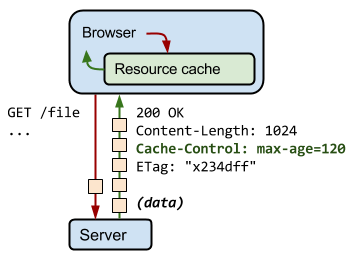

## Image cache

## Preload cache

## Service worker

## HTTP cache

### 意义

通过网络获取内容速度既缓慢又开销巨大。 较大的响应需要在客户端与服务器之间进行多次往返通信，这会延迟浏览器获得和处理内容的时间，还会增加访问者的流量费用。 因此，缓存并重复利用之前获取的资源的能力成为性能优化的一个关键方面。

### 浏览器处理

每个浏览器都自带了 HTTP 缓存实现功能。 您只需要确保每个服务器响应都提供正确的 HTTP 标头指令，以指示浏览器何时可以缓存响应以及可以缓存多久。

> 注：如果您在应用中使用 Webview 来获取和显示网页内容，可能需要提供额外的配置标志，以确保 HTTP 缓存得到启用、其大小根据用例进行了合理设置并且缓存将持久保存。 务必查看平台文档并确认您的设置！

当服务器返回响应时，还会发出一组 HTTP 标头，用于描述响应的内容类型、长度、缓存指令、验证令牌等。 例如，在上图的交互中，服务器返回一个 1024 字节的响应，指示客户端将其缓存最多 120 秒，并提供一个验证令牌（“x234dff”），可在响应过期后用来检查资源是否被修改。

### ETag

* 服务器使用 ETag HTTP 标头传递验证令牌
* 验证令牌可实现高效的资源更新检查：资源未发生变化时不会传送任何数据

假定在首次提取资源 120 秒后，浏览器又对该资源发起了新的请求。 首先，浏览器会检查本地缓存并找到之前的响应。 遗憾的是，该响应现已过期，浏览器无法使用。 此时，浏览器可以直接发出新的请求并获取新的完整响应。 不过，这样做效率较低，因为如果资源未发生变化，那么下载与缓存中已有的完全相同的信息便毫无意义！

这正是验证令牌（在 ETag 标头中指定）旨在解决的问题。 服务器生成并返回的随机令牌通常是文件内容的哈希值或某个其他指纹。 客户端不需要了解指纹是如何生成的，只需在下一次请求时将其发送至服务器。 如果指纹仍然相同，则表示资源未发生变化，您就可以避免下载重复的资源。

在上例中，客户端自动在 `If-None-Match` HTTP 请求标头内提供 ETag 令牌。 服务器根据当前资源核对令牌。 如果它未发生变化，服务器将返回“304 Not Modified”响应，告知浏览器缓存中的响应未发生变化，可以再延用 120 秒。 请注意，您不必再次下载响应，这节约了时间和带宽。

> 作为网络开发者，您如何利用高效的重新验证？

浏览器会替我们完成所有工作：它会自动检测之前是否指定了验证令牌，它会将验证令牌追加到发出的请求上，并且它会根据从服务器接收的响应在必要时更新缓存时间戳。 **我们唯一要做的就是确保服务器提供必要的 ETag 令牌。 检查您的服务器文档中有无必要的配置标记。**

> 主流服务器[配置文件样例](https://github.com/h5bp/server-configs)

### Cache-Control

* 每个资源都可通过 Cache-Control HTTP 标头定义其缓存策略
* Cache-Control 指令控制谁在什么条件下可以缓存响应以及可以缓存多久

从性能优化的角度来说，最佳请求是无需与服务器通信的请求：您可以通过响应的本地副本消除所有网络延迟，以及避免数据传送的流量费用。 为实现此目的，HTTP 规范允许服务器返回 Cache-Control 指令，这些指令控制浏览器和其他中间缓存如何缓存各个响应以及缓存多久。

> 注：Cache-Control 标头是在 HTTP/1.1 规范中定义的，取代了之前用来定义响应缓存策略的标头（例如 Expires）。 所有现代浏览器都支持 Cache-Control。

#### no-cache 和 no-store

`no-cache` 表示必须先与服务器确认返回的响应是否发生了变化，然后才能使用该响应来满足后续对同一网址的请求。 因此，如果存在合适的验证令牌 (ETag)，no-cache 会发起往返通信来验证缓存的响应，但如果资源未发生变化，则可避免下载。

相比之下，`no-store` 则要简单得多。 它直接禁止浏览器以及所有中间缓存存储任何版本的返回响应。例如，包含个人隐私数据或银行业务数据的响应。 每次用户请求该资产时，都会向服务器发送请求，并下载完整的响应。

#### public 与 private

如果响应被标记为 `public`，则客户端和所有中间代理都可以缓存响应。

相比之下，仅浏览器可以缓存 `private` 响应，不允许任何中间缓存对其进行缓存。 例如，用户的浏览器可以缓存包含用户私人信息的 HTML 网页，但 CDN 却不能缓存。

#### max-age

指令指定从请求的时间开始，允许提取的响应被重用的最长时间（单位：秒）。 例如，“max-age=60”表示可在接下来的 60 秒缓存和重用响应。

#### 最佳 Cache-Control 策略

按照以上决策树为您的应用使用的特定资源或一组资源确定最佳缓存策略。 在理想的情况下，您的目标应该是在客户端上缓存尽可能多的响应，缓存尽可能长的时间，并且为每个响应提供验证令牌，以实现高效的重新验证。

> Refer [HTTP Caching](https://developers.google.com/web/fundamentals/performance/optimizing-content-efficiency/http-caching) **By Ilya Grigorik**

## Push cache
