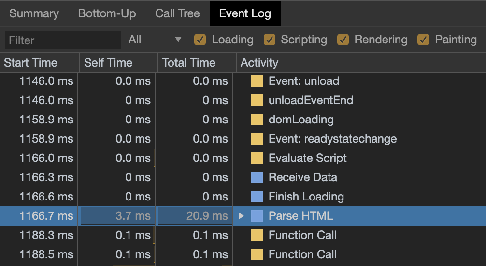

# What's CRP?

Intermediate steps between receiving the HTML, CSS, and JavaScript bytes and the required processing to turn them into rendered pixels.

# Constructing the Object Model

## Document Object Model (DOM)

### Example

```html
<!DOCTYPE html>
<html>
  <head>
    <meta name="viewport" content="width=device-width,initial-scale=1">
    <link href="style.css" rel="stylesheet">
    <title>Critical Path</title>
  </head>
  <body>
    <p>Hello <span>web performance</span> students!</p>
    <div></div>
  </body>
</html>
```


### Steps Flow


- **Conversion:** The browser reads the raw bytes of HTML off the disk or network, and translates them to individual characters based on specified encoding of the file (for example, UTF-8).

- **Tokenizing:** The browser converts strings of characters into distinct tokens; for example, "<html>", "<body>"—and other strings within angle brackets.
  
- **Lexing:** The emitted tokens are converted into "objects," which define their properties and rules.

- **DOM construction:** The created objects are linked in a tree data structure based on their relationships defined in the HTML markup; the HTML object is a parent of the body object, the body is a parent of the paragraph object, and so on.

### Output


The final output of this entire process is the Document Object Model (DOM) of our simple page, which the browser uses for all further processing of the page.

### Updates

Every time the browser processes HTML markup, it goes through all of the steps above: convert bytes to characters, identify tokens, convert tokens to nodes, and build the DOM tree. This entire process can take some time, especially if we have a large amount of HTML to process.

When creating smooth animations, this can easily become a bottleneck if the browser has to process large amounts of HTML.

### Timing



## CSS Object Model (CSSOM)

### Example

While the browser was constructing the DOM of our simple page, it encountered a link tag in the head section of the document referencing an external CSS stylesheet: style.css. Anticipating that it needs this resource to render the page, it immediately dispatches a request for this resource, which comes back with the following content:

```css
body { font-size: 16px }
p { font-weight: bold }
span { color: red }
p span { display: none }
img { float: right }
```

### Steps Flow

As with HTML, we need to convert the received CSS rules into something that the browser can understand and work with. Hence, we repeat the HTML process, but for CSS instead of HTML.


### Output


**Why does the CSSOM have a tree structure?**

When computing the final set of styles for any object on the page, the browser starts with the most general rule applicable to that node (for example, if it is a child of a body element, then all body styles apply) and then recursively refines the computed styles by applying more specific rules; that is, the rules "cascade down."

To make it more concrete, consider the CSSOM tree above. Any text contained within the <span> tag that is placed within the body element, has a font size of 16 pixels and has red text—the font-size directive cascades down from the body to the span. However, if a span tag is child of a paragraph (p) tag, then its contents are not displayed.
  
### Timing

To find out how long the CSS processing takes you can record a timeline in DevTools and look for "Recalculate Style" event: unlike DOM parsing, the timeline doesn’t show a separate "Parse CSS" entry, and instead captures parsing and CSSOM tree construction, plus the recursive calculation of computed styles under this one event.


The CSSOM and DOM are independent data structures! Turns out, the browser is hiding an important step.
