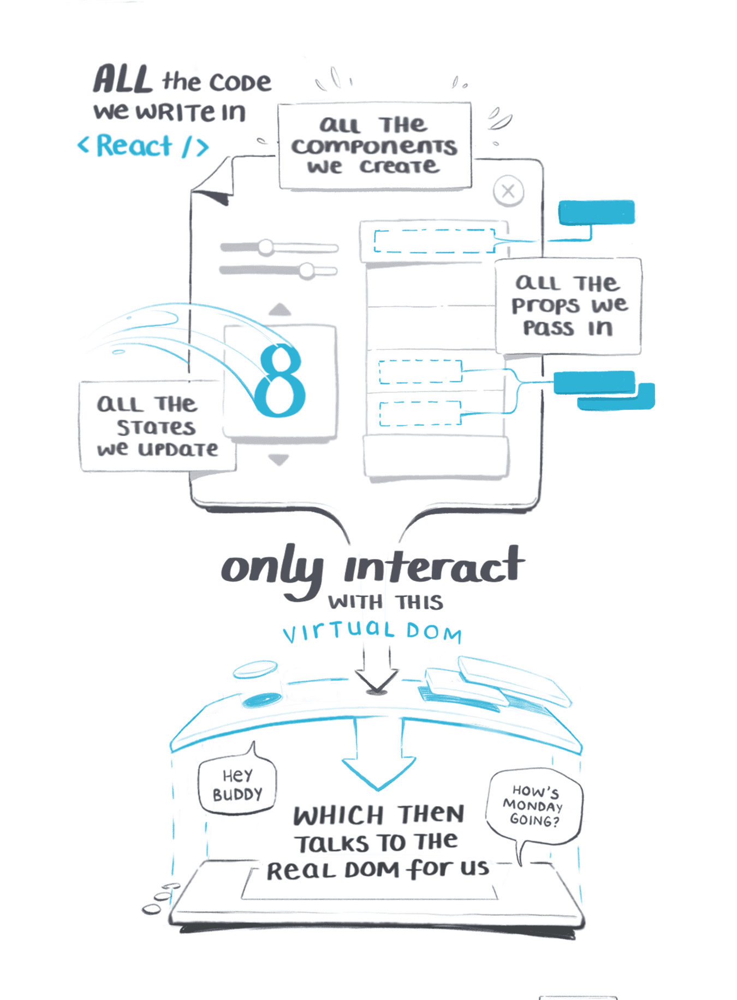
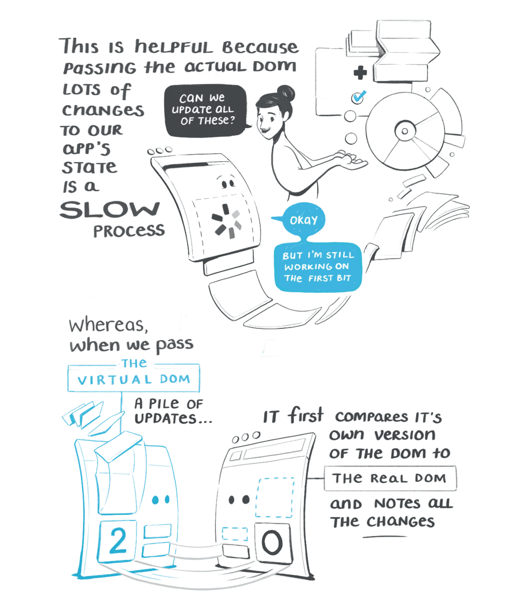
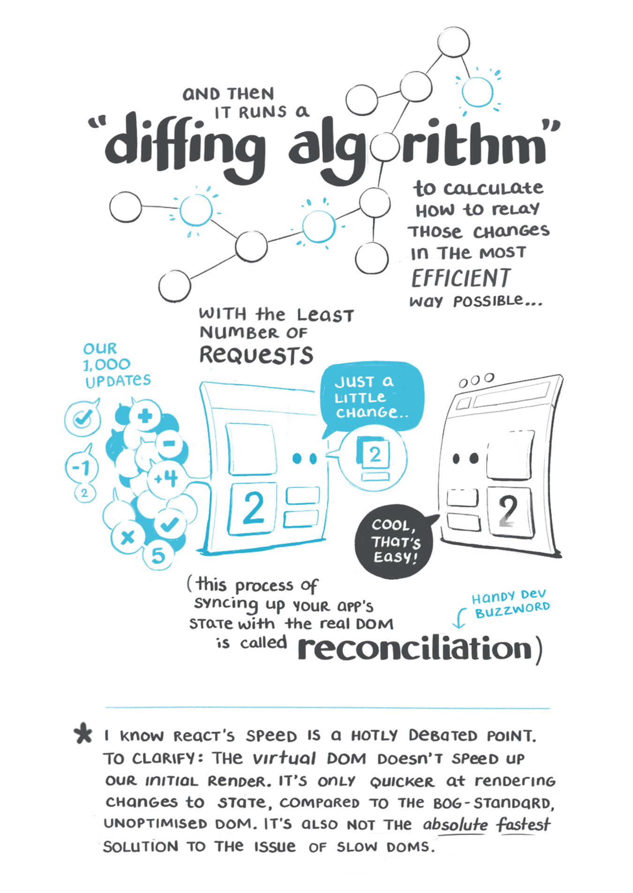

# React Intro

## What is React?

- 声明式、高效、灵活的用于构建 UI 的 JavaScript 库
- 面向组件编程
- *Model* – **View** – *Controller*

## Why should I use React?

### 可重用组件

```
UI = f(state)
```


### 高效 (虚拟 DOM)






### 易测试

- 可预测 *UI = f(state)*
- Mock state, then we can expect the outputs

### SSR

- 无需等待 JS (JIT) 加载和执行


### 单向数据流

- 状态可预测
- 组件解耦
- 灵活高效开发

## How to use React?

### JSX

- HTML-style
- React 语法糖

Babel 会把 JSX 转译成一个名为 React.createElement() 函数调用。

```javascript
const element = (
  <h1 className="greeting">
    Hello, world!
  </h1>
);
```

等价写法：

```javascript
const element = React.createElement(
  'h1',
  {className: 'greeting'},
  'Hello, world!'
);
```

React.createElement() 实际上创建了一个这样的对象：

```javascript
// 注意：这是简化过的结构
const element = {
  type: 'h1',
  props: {
    className: 'greeting',
    children: 'Hello, world!'
  }
};
```

### 元素与组件

- React 元素
  
  元素是构成 React 应用的最小砖块，它描述了你在屏幕上想看到的内容。
  
  不同于浏览器 DOM 元素，React 元素是开销极小的普通对象。ReactDOM 负责更新 DOM 来与 React 元素保持一致。

- 组件
  
  组件是由元素构成的独立可复用的代码片段，并对每个片段进行独立构思。

  - 函数组件

    ```javascript
    function Welcome(props) {
        return <h1>Hello, {props.name}</h1>;
    }
    ```

  - 类组件

    ```javascript
    class Welcome extends React.Component {
        render() {
            return <h1>Hello, {this.props.name}</h1>;
        }
    }
    ```

### Props

```javascript
const element = <Welcome name="Sara" />;
```

React 将 JSX 所接收的属性（attributes）以及子组件（children）转换为单个对象传递给组件，这个对象被称之为 "props"。

**Props是只读的，任何组件都不应修改其Props对象。**

*那么 UI 如何响应变化呢？*

### State

State 与 props 类似，但是 state 是私有的，并且完全受控于当前组件。

```javascript
class Clock extends React.Component {
  constructor(props) {
    super(props);
    this.state = {date: new Date()}; // State 初始化
  }

  render() {
    return (
      <div>
        <h1>Hello, world!</h1>
        <h2>It is {this.state.date.toLocaleTimeString()}.</h2>
      </div>
    );
  }
}

ReactDOM.render(
  <Clock />,
  document.getElementById('root')
);
```

### 生命周期

```javascript
class Clock extends React.Component {
  constructor(props) {
    super(props);
    this.state = {date: new Date()};
  }

  // DOM 挂载完成
  componentDidMount() {
    this.timerID = setInterval(
      () => this.tick(),
      1000
    );
  }

  // DOM 即将被卸载
  componentWillUnmount() {
    clearInterval(this.timerID);
  }

  tick() {
    // 更新 State, 触发 render
    this.setState({
      date: new Date()
    });
  }

  render() {
    return (
      <div>
        <h1>Hello, world!</h1>
        <h2>It is {this.state.date.toLocaleTimeString()}.</h2>
      </div>
    );
  }
}

ReactDOM.render(
  <Clock />,
  document.getElementById('root')
);
```

### 事件处理

- React 事件的命名采用小驼峰式（camelCase），而不是纯小写
- 使用 JSX 时传入一个函数作为事件处理函数，而不是一个字符串
- React 中事件 event 是合成事件，自带兼容特性

传统的 HTML 方式：

```html
<button onclick="activateLasers()">
  Activate Lasers
</button>
```

在 React 中：

```html
<button onClick={activateLasers}>
  Activate Lasers
</button>
```

### 
