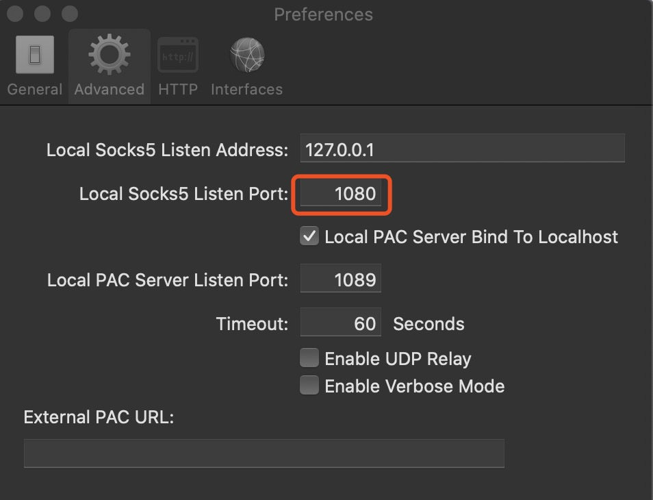

# 自建 VPN

## 购买服务器

### VPS 选择

选择服务商：*[DigitalOcean](https://cloud.digitalocean.com/)*

自用推荐基础款：**$5/month**

> 撸羊毛：[GitHub Student Developer Pack](https://education.github.com/pack#offers)，认证学生后 DigitalOcean 有 $50 优惠券。

## 连接服务器

**MACOS**

```shell
ssh -p 22 {username}@{ip}
```

**Windows**

[putty](https://www.putty.org/)

> *putty使用方法网上查找吧。*

## 服务器安装 Shadowsocks/SS

*推荐使用一键脚本安装*

[根据服务器类型选择对应脚本安装](https://github.com/hijkpw/scripts)

> 傻瓜式安装，根据出错信息补装缺失模块。

## 客户端配置

### 下载客户端 ShadowsocksX-NG

[官网地址](https://github.com/shadowsocks/ShadowsocksX-NG/releases)

*下载后解压安装即可，Mac 右上角会出现纸飞机图标。*

### ShadowsocksX-NG 配置

[配置教程](https://www.hijk.pw/shadowsocksx-ng-config-tutorial/)

### 可能出现的问题

*服务器和客户端均显示运行正常，但是无法翻墙上网？*

**解决方法：**

本地检查默认代理端口`1086`是否被占用

```
lsof -i tcp:1086
```

如果端口 1086 被占用，更换成其他未被占用的端口即可 (如：1080)。


