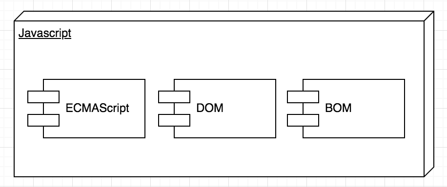
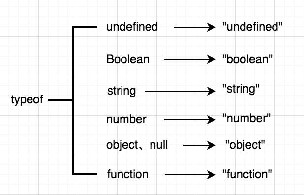
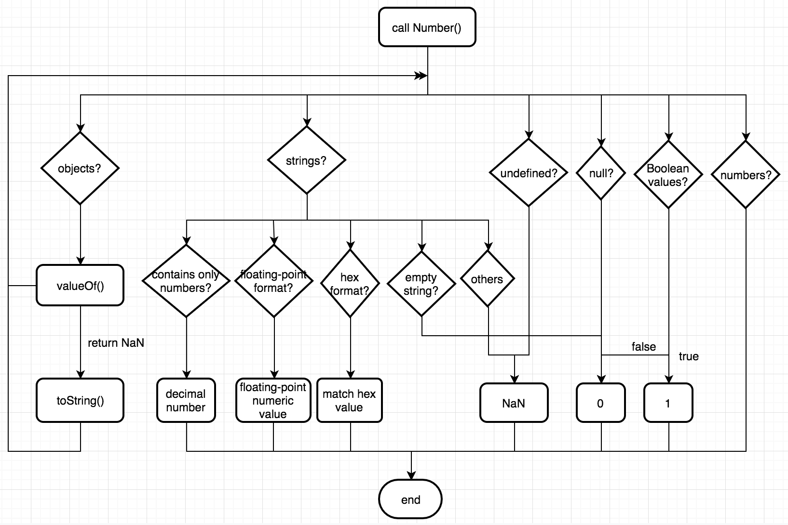
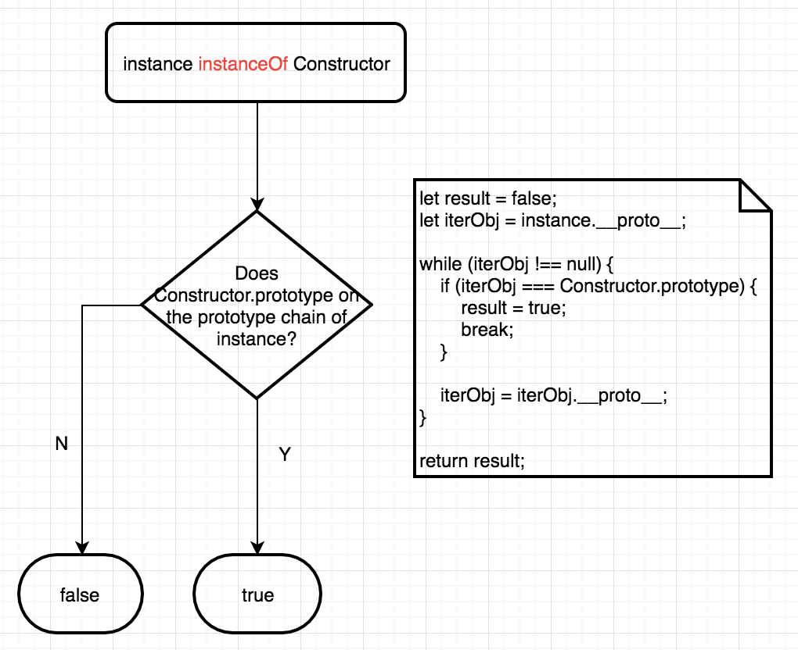
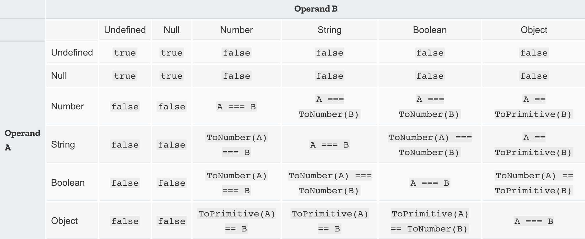
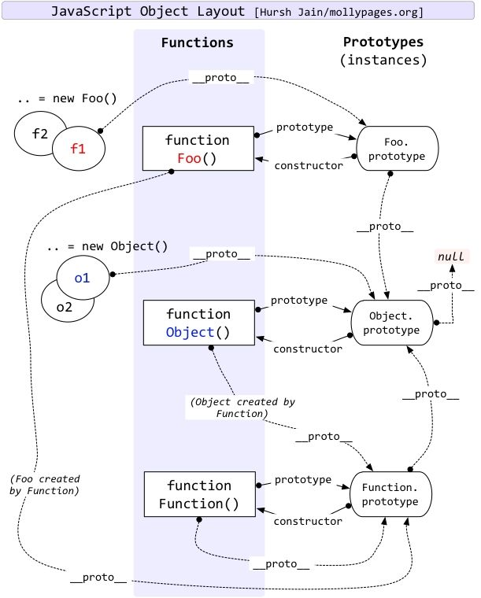
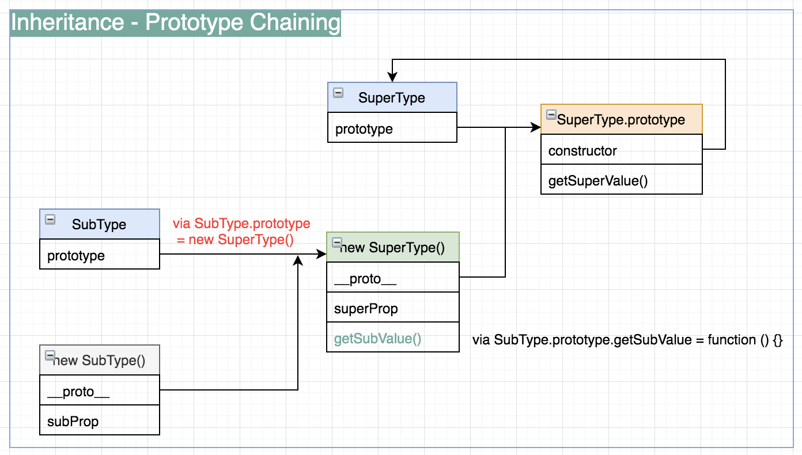
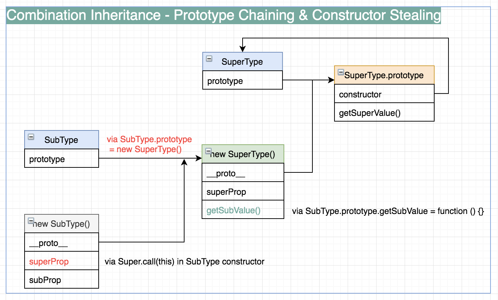
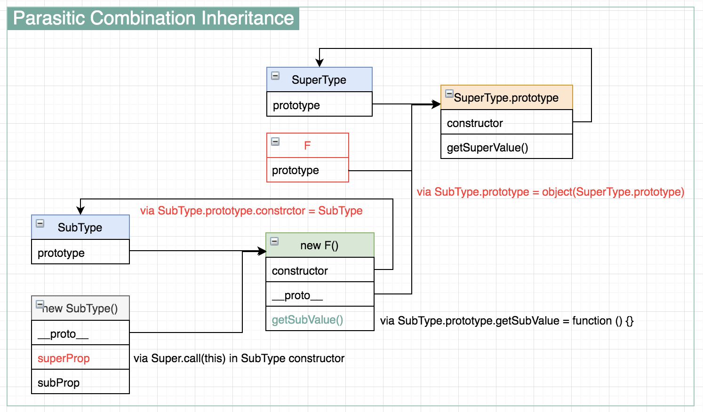

## No Extra Words, Just Images

1. Javascript implementations

2. Async vs Defer scripts

3. Typeof

4. Number conversions

5. InstanceOf

6. Equality comparison

7. Javascript object layout

8. Inheritance

