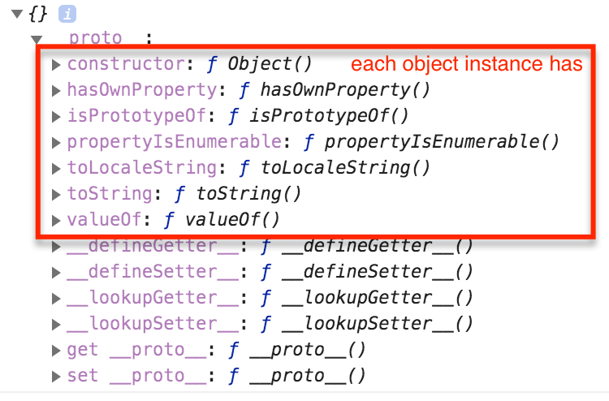

## No extra words, just images

1. Javascript implementations

2. Async vs Defer scripts

3. Typeof

4. Number conversions

5. Object type basics

6. Equality comparison

7. Javascript object layout

8. Inheritance

